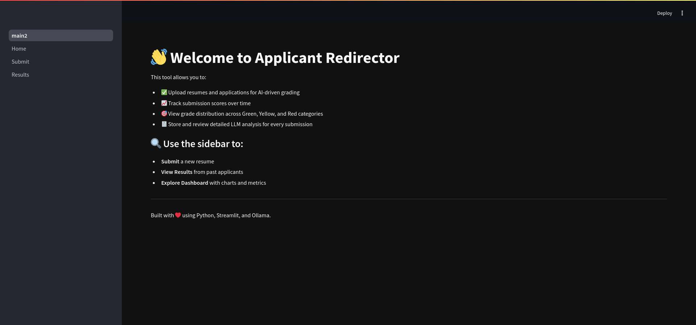
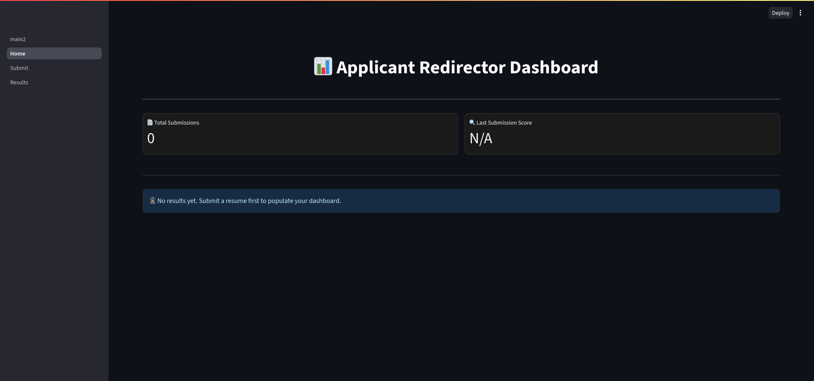
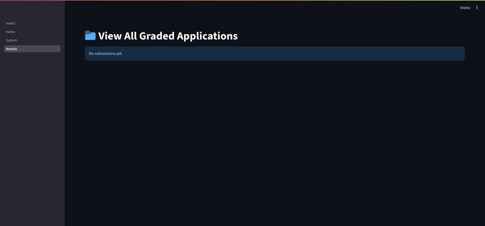
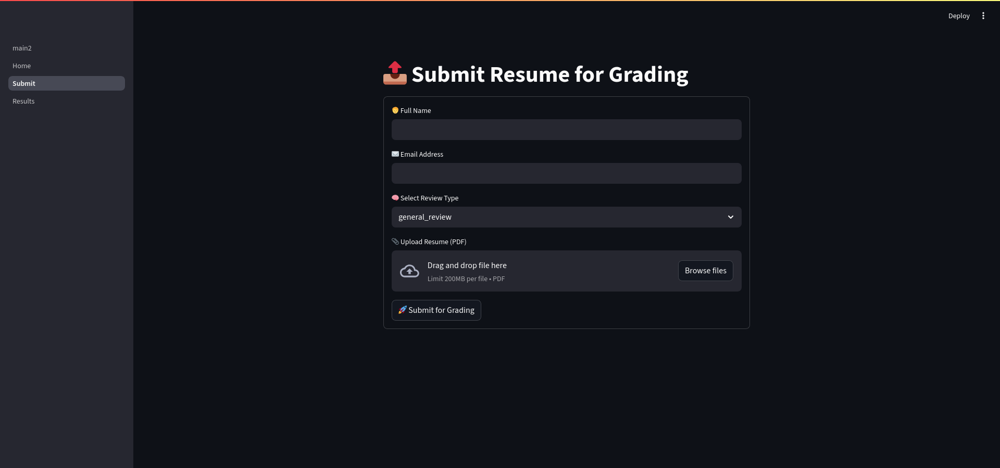

# 🧠 Applicant Redirector – AI Resume Grader & Visualizer

This is an AI-powered desktop/web dashboard app built with **Streamlit**, designed to analyze resumes (PDF uploads), send them through an **LLM-based grader**, score them, export a feedback PDF, and store results in a local **SQLite** database for later review and metrics.

> Built by [Neal Frazier](https://nealfrazier.tech) — Streamlined job application redirection with real-time grading insights.

---

## 🚀 Features

- 📄 **PDF Resume Submission** (with name, email, grading preset)
- 🧠 **AI-Powered LLM Grading** via Ollama or local model
- 🧾 **Feedback + Score Extraction** and storage
- 📊 **Dashboard View**: See total submissions, score trend graph, and grade pie chart
- 📁 **View All Submissions** with downloadable PDF feedback reports
- 📂 **Local Data Storage** using `SQLite` in `data/history.db`
- 🧷 Designed with **modular architecture** for maintainability
- 🔒 Fully offline-ready (no cloud APIs needed if using local LLM)

---

## 📸 Screenshots

### 📊 Dashboard Overview

### 🏠 Home Page

### 📁 Results Viewer

### 📤 Submission Form

---

## 🛠️ Tech Stack

- Frontend/UI: `Streamlit`
- Backend Logic: `Python`, `FPDF`, `Ollama`, `SQLite`
- Visualization: `Matplotlib`
- PDF Parsing: `PyMuPDF (fitz)`

---

## 📂 Directory Structure

# Resume-Grader-ATS-Savior
